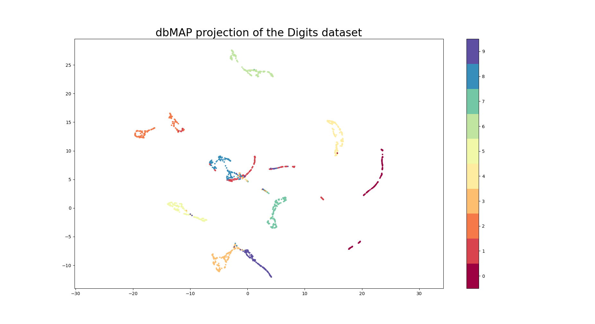
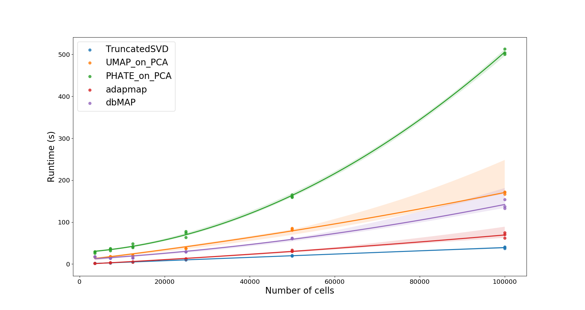

# Welcome to dbMAP documentation

Diffusion-based Manifold Approximaiton and Projection (dbMAP) is a fast, accurate and modularized dimensional reduction approach. dbMAP includes:
<br />
<br />
	- a flexible and extendable wrapper for nmslib (ultra-fast neighborhood search), 
<br />	
	- functions for fast computation of diffusion dynamics and multiscale maps, 
<br />
<br />
	- and a fast implementation of adapted graph and UMAP layouts. 
<br />
<br />
dbMAP was originally designed for the fast analysis and visualization of single-cell omics data - yet, as a general dimensional reduction approach, it can find use in virtually any field in which analysis of high-dimensional data is challenging. You can read more about how dbMAP works at the 'About' section. For more information on dbMAP, check our first preprint at [SneakPeak](https://papers.ssrn.com/sol3/papers.cfm?abstract_id=3582067).


## Quick Start

# Installation and dependencies

   Prior to installing dbMAP, make sure you have scikit-build and cmake available in your system. These are required for installation.
   
````
sudo apt-get install cmake
pip3 install scikit-build
````
   
   We're also going to need NMSlib for really fast approximate nearest-neighbor search which powers dbMAP escalability:
   
````
pip3 install nmslib
````
   
   You can read more about NMSlib  [here](https://github.com/nmslib/nmslib), and check more on the available distances and spaces documentation [here](https://github.com/nmslib/nmslib/blob/master/manual/spaces.md). dbMAP implements utility functions on NMSlib that make it more genrally extendable to machine-leraning workflows, and we are grateful to the nmslib community for their insights during this process.
   
   dbMAP has been implemented in Python3, and can be installed using 
```
pip3 install dbmap
```
 or if python3 is your default python interpreter:
 
```
pip install dbmap
``` 

# Usage - Python

  dbMAP consists of two main steps: an adaptive anisotropic reproduction of the initial input diffusion structure, followed by an accelerated UMAP or graph layout. dbMAP runs on numpy arrays, pandas dataframes and csr or coo sparse matrices. The adaptive diffusion reduction is recommended over PCA if data is significantly non-linear, and is useful for clustering and downstream analysis. The UMAP and graph layouts are also useful for big data visualization. 
  Here follows some examples on using dbMAP implemented algorithms, including fast neighborhood search, adaptive multiscaled diffusion maps and accelerated UMAP and graph layouts:
  
## 1 - Fast approximate k-nearest-neighbors
  dbMAP implements the NMSlibTransformer() class, which calls nmslib to perform a fast and accurate approximate nearest neighbor search. The NMSlibTransformer() class has several methods to compute and retrieve this information, and an additional function to measure it's accuracy.

```
# Load some libraries:
from sklearn.datasets import load_digits
from scipy.sparse import csr_matrix
import dbmap as dm

# Load some data and convert to CSR for speed:
digits = load_digits()
data = csr_matrix(digits.data)

# Initialize the NMSlibTransformer() object and index the data:
anbrs = dm.ann.NMSlibTransformer() # Feel free to play with parameters
anbrs = anbrs.fit(data)

# Compute the k-nearest-neighbors graph:
knn_graph = anbrs.transform(data)

# Compute indices, distances, gradient and knn_neighbors graph:
inds, dists, grad, knn = anbrs.ind_dist_grad(data)

# Test approximate-neighbors accuracy:
anbrs.test_efficincy(data)
```

## 2 - Fast adaptive multiscaled diffusion maps
  dbMAP implements the Diffusor() class, which allows state-of-the-art dimensional reduction by the fast approximation of the Laplace Beltrami operator and automatic detection of intrinsic dimensionality. This algorithm learns a local metric which is normalized and embedded as a diffusion distance on the series of orthogonal components that define structure variability within the initial informational space.
  Default machine-learning analysis sometimes employs PCA on highly non-linear data despite its caveat of being unsuitable for datasets which cannot be represented as a series of linear correlations. The main reason for this is the low computational cost of PCA compared to non-linear dimensional reduction methods. Our implementation is scalable to extremely high-dimensional datasets (10e9 samples) and oughts to provide more reliable information than PCA on real-world, non-linear data. Similarly to our fast nearest-neighbor implementation, we provide utility functions to obtain results in different formats.
  
```
# Load some libraries:
from sklearn.datasets import load_digits
from scipy.sparse import csr_matrix
import dbmap as dm

# Load some data and convert to CSR for speed:
digits = load_digits()
data = csr_matrix(digits.data)
  
# Initialize the diffusor object and fit data:
diff = dm.diffusion.Diffusor().fit(data)
   
# Return low dimensional representation of data:
res = diff.transform(data)
   
# Return the diffusion indices, distances, diffusion gradient and diffusion graph:
ind, dist, grad, graph = diff.ind_dist_grad(data)  
```
  
## 3 - Fast mapping layout
   
   For scalable big data visualization, we provide a fast mapping layout of the adaptive multiscale diffusion components space. We adapted UMAP to construct fast approximate simplicial complexes wich normalizes the data structure, rendering a comprehensive layout. We also provide fast graph layout of the resulting components with fa2, which implements scalable and interative layouts within networkx. A vanilla UMAP implementation is also provided.
      
```
# Load some libraries:
from sklearn.datasets import load_digits
from scipy.sparse import csr_matrix
import dbmap as dm
import matplotlib.pyplot as plt

# Load some data and convert to CSR for speed:
digits = load_digits()
data = csr_matrix(digits.data)
  
# Initialize the diffusor object, fit data and transform:
res = dm.diffusion.Diffusor().fit(data).transform(data)
 
# Embed graph with a fast approximate UMAP layout:
emb = dm.umapper.AMAP(min_dist=0.1).fit_transform(res.to_numpy(dtype='float32'))
   
plt.scatter(emb[:, 0], emb[:, 1], c=digits.target, cmap='Spectral', s=5)
plt.gca().set_aspect('equal', 'datalim')
plt.colorbar(boundaries=np.arange(11)-0.5).set_ticks(np.arange(10))
plt.title('dbMAP projection of the Digits dataset', fontsize=24)
plt.show()

# Embed graph with vanilla UMAP:
emb = dm.map.UMAP().fit(transform(res.to_numpy(dtype='float32'))
   
plt.scatter(emb[:, 0], emb[:, 1], c=digits.target, cmap='Spectral', s=5)
plt.gca().set_aspect('equal', 'datalim')
plt.colorbar(boundaries=np.arange(11)-0.5).set_ticks(np.arange(10))
plt.title('diffusion-based UMAP projection of the Digits dataset', fontsize=24)
plt.show()   
```



# Benchmarking

As we prepare for a second version of the manuscript, extensive benchmarking of dbMAP and other dimensionality reduction methods is underway. For the time being, consider the runtime comparison between PCA, dbMAP (and its diffusion process alone) and the fastest non-linear algorithms to date: PHATE and UMAP.




# Citation

We kindly ask that you cite dbMAP and the manuscript that lead to NMSlib if you use these algorithms for your work:

```
Sidarta-Oliveira, Davi and Velloso, Licio, Comprehensive Visualization of High-Dimensional Single-Cell Data With Diffusion-Based Manifold Approximation and Projection (dbMAP). CELL-REPORTS-D-20-01731. Available at SSRN: https://ssrn.com/abstract=3582067 or http://dx.doi.org/10.2139/ssrn.3582067

Malkov, Y.A., Yashunin, D.A.. (2016). Efficient and robust approximate nearest neighbor search using Hierarchical Navigable Small World graphs. CoRR, abs/1603.09320. [BibTex]

```

# License and disclaimer

This program is free software: you can redistribute it and/or modify it under the terms of the GNU General Public License as published by the Free Software Foundation, either version 3 of the License, or (at your option) any later version.

This program is distributed in the hope that it will be useful, but WITHOUT ANY WARRANTY; without even the implied warranty of MERCHANTABILITY or FITNESS FOR A PARTICULAR PURPOSE. See the GNU General Public License for more details.

You should have received a copy of the GNU General Public License along with this program. If not, see https://www.gnu.org/licenses/.


